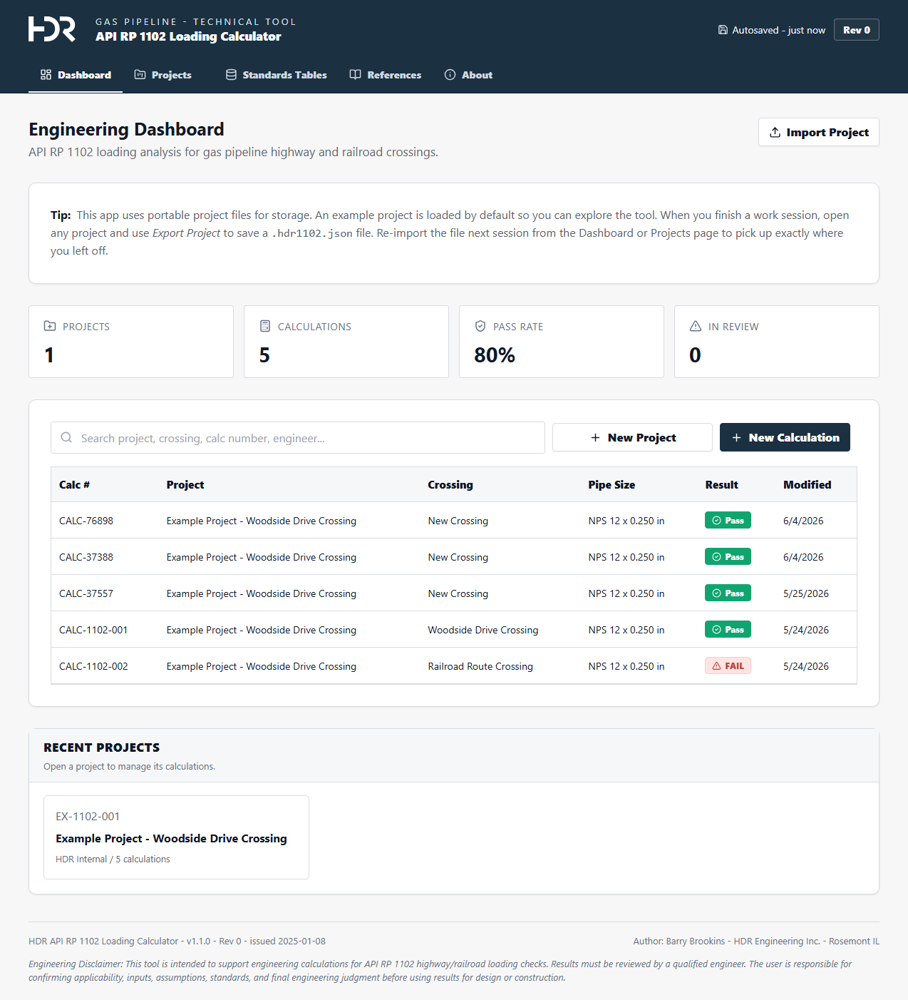
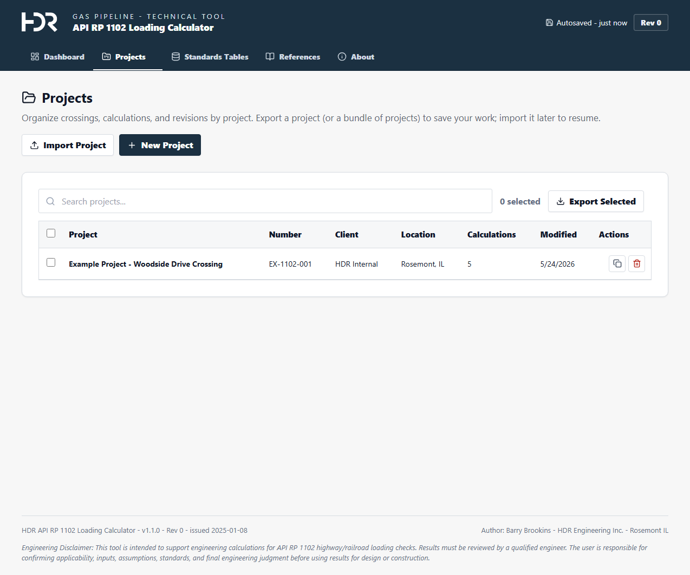
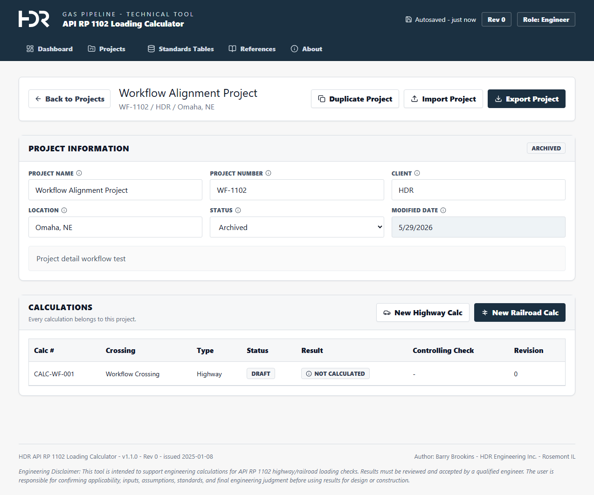
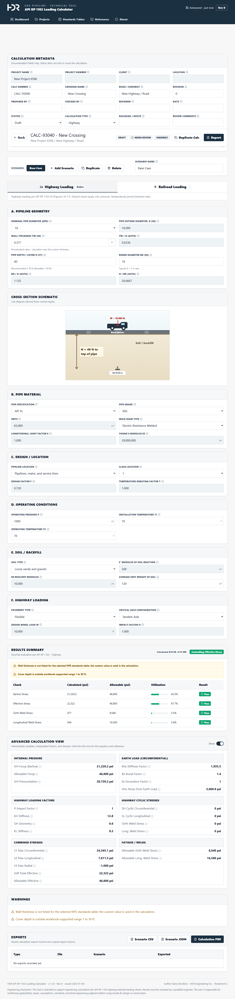
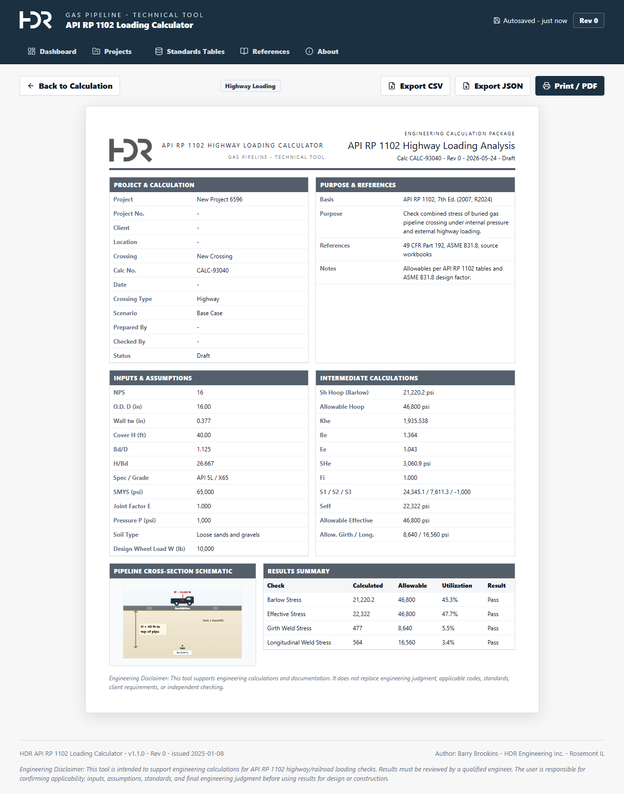

# API RP 1102 Loading Calculator

API RP 1102 Loading Calculator is an engineering calculation application used to evaluate natural gas pipeline crossings beneath highways and railroads. It supports API RP 1102-based stress checks, highway and railroad loading cases, pipe/soil/load input validation, calculation summaries, pass/fail results, warning callouts, and engineering documentation workflows.

---

## Table of Contents

- [Overview](#overview)
- [Key Features](#key-features)
- [Use Cases](#use-cases)
- [Engineering Scope](#engineering-scope)
- [Screenshots](#screenshots)
- [Calculation Workflow](#calculation-workflow)
- [Inputs](#inputs)
- [Outputs](#outputs)
- [Calculation Methodology](#calculation-methodology)
- [Validation and Assumptions](#validation-and-assumptions)
- [Units and Conventions](#units-and-conventions)
- [Installation](#installation)
- [Configuration](#configuration)
- [How to Use](#how-to-use)
- [Example Project](#example-project)
- [File Structure](#file-structure)
- [Known Limitations](#known-limitations)
- [Quality Checks and Warnings](#quality-checks-and-warnings)
- [Roadmap](#roadmap)
- [Contributing](#contributing)
- [Engineering Disclaimer](#engineering-disclaimer)
- [License](#license)

---

## Overview

This app helps engineers perform API RP 1102-based stress evaluations for steel natural gas pipelines crossing beneath highways and railroads. It calculates stresses from internal pressure, earth loading, live loading, and crossing-specific assumptions, then compares calculated results against allowable limits. The app is intended for engineers, reviewers, and project teams who need a repeatable workflow for creating projects, documenting crossing inputs, checking scenarios, and preparing calculation reports.

The tool supports both Highway and Railroad loading calculations. It can be used to document evaluations for new or existing crossings when the engineer provides the appropriate pipe, soil, cover, pressure, and loading inputs. Compared with spreadsheet-only workflows, the app centralizes standards lookup tables, keeps scenarios with their project record, recalculates results when inputs change, surfaces validation warnings, and produces a consistent browser-print report for review.

---

## Key Features

- Create project records and manage multiple calculations inside each project.
- Create distinct API RP 1102 Highway and Railroad loading calculations.
- Automatically initialize each new calculation with a calculated Base Case scenario.
- Support multiple scenarios for the same crossing.
- Duplicate and delete projects, calculations, and scenarios, including bulk delete for selected projects or calculations.
- Enter pipe geometry, material, pressure, soil, cover, bore, highway loading, and railroad loading inputs.
- Use standards-driven dropdowns and lookup tables for common engineering inputs.
- Allow custom positive wall thickness values while warning when they are nonstandard for the selected NPS.
- Calculate internal pressure stress, earth load effects, live load effects, effective stress, and design checks.
- Aggregate scenario results into calculation-level pass/fail/needs-review summaries.
- Display warnings, stale-result freshness metadata, utilization bars, and controlling checks.
- Preview and browser-print a one-page calculation report.
- Export project, calculation, and scenario data as JSON or CSV packages.
- Import project packages for local reuse.

---

## Use Cases

- New pipeline crossing design beneath a highway.
- New pipeline crossing design beneath a railroad.
- Existing pipeline crossing evaluation using known pipeline and crossing inputs.
- Review of cover depth, wall thickness, pressure, soil, pavement, axle, track, or surface pressure assumptions.
- Comparison of alternate pipe wall thicknesses or crossing scenarios.
- Determination of whether a crossing needs closer engineering review based on failed checks or warnings.
- Internal QA/QC review of API RP 1102 calculations.
- Standardizing company calculation documentation and report format.

---

## Engineering Scope

### Included

- API RP 1102-based highway crossing evaluations.
- API RP 1102-based railroad crossing evaluations.
- Buried steel natural gas pipeline crossings.
- Internal pressure stress checks.
- Earth load effects.
- Vehicle or rail live load effects.
- Combined/effective stress checks.
- Pipe wall thickness comparison.
- Cover depth sensitivity checks.
- Basic soil input handling through standards lookup tables.
- Pass, Fail, Needs Review, and Not Calculated result summaries.
- Warning callouts for invalid, out-of-range, or review-needed inputs.

### Not Included

- Full finite element analysis.
- Transient pressure surge analysis.
- Fatigue analysis beyond the implemented API RP 1102 workflow.
- Detailed casing design unless explicitly implemented in the calculation workflow.
- Geotechnical design of soil support.
- Settlement analysis.
- Buoyancy calculations.
- HDD pullback stress calculations.
- Automatic approval for construction, permitting, or code compliance.
- Replacement for independent engineering judgment or checking.

---

## Screenshots











Additional screenshot references used during UI alignment are stored in `App Screenshots/`, and the screenshot audit is documented in `docs/screenshot-audit.md`.

---

## Calculation Workflow

1. Create or open a project.
2. Create a Highway or Railroad calculation inside the project.
3. Review the automatically created Base Case scenario.
4. Enter or adjust crossing metadata, pipe geometry, material, design, pressure, soil, and loading inputs.
5. Review validation warnings and standards-driven dropdown values.
6. Review the live schematic, results summary, utilization bars, controlling check, and advanced intermediate values.
7. Duplicate scenarios when alternate assumptions need to be compared.
8. Open the report preview and use browser print/PDF for the final review package.
9. Export JSON or CSV data packages as needed for recordkeeping or import.

---

## Inputs

The app organizes inputs into compact engineering sections:

- Project metadata: project name, number, client, location, status, and description.
- Calculation metadata: calculation number, crossing name, route/road/railroad information, revision, date, preparer, checker, and notes.
- Pipeline geometry: NPS, outside diameter, wall thickness, bore diameter, cover depth, `Bd/D`, and `H/Bd`.
- Pipe material: pipe specification, grade, SMYS, weld seam type, joint factor, and elastic modulus.
- Design/location: pipeline location, class location, design factor, and temperature derating factor.
- Operating conditions: operating pressure, installation temperature, and operating temperature.
- Soil/backfill: soil type, soil unit weight, modulus of soil reaction, and resilient modulus.
- Highway loading: pavement type, axle configuration, design wheel load, and impact factor.
- Railroad loading: number of tracks, surface pressure, and track factors.

---

## Outputs

The app presents:

- Scenario-level result metadata and calculated-at freshness indicators.
- Stress and allowable values for major checks.
- Pass, Fail, Needs Review, or Not Calculated outcomes.
- Controlling check and utilization bars.
- Warning callouts for validation and review conditions.
- Advanced/intermediate calculation values.
- A live cross-section schematic scaled from current geometry.
- A browser-print calculation report formatted for one letter-size page.
- JSON exports for projects, calculations, and scenarios.
- CSV exports for calculation/scenario result data.

---

## Calculation Methodology

The calculation engine follows the implemented API RP 1102 workflow for highway and railroad loading cases. It combines shared pipeline, soil, pressure, geometry, and design inputs with mode-specific loading inputs, then calculates intermediate stress components and final checks.

The app uses repo-local reference workbooks as validation sources:

- `Refs/Copy of API 1102 Highway.xlsx`
- `Refs/Copy of API 1102 Railroad.xlsx`

Automated validation compares app outputs against mapped workbook cells for default and edited highway/railroad scenarios. The current workflow preserves the spreadsheet-derived formula behavior unless tests identify a specific parity issue.

---

## Validation and Assumptions

- New calculations are initialized with mode-specific default inputs and a calculated Base Case scenario.
- Calculation types are limited to `Highway` and `Railroad`.
- Legacy or unknown imported calculation types are normalized to Highway for compatibility.
- Scenario create, update, delete, and calculation type changes refresh affected results.
- Calculation summary results aggregate scenarios by worst-case priority: Fail, Needs Review, Pass, then Not Calculated.
- Nonstandard positive wall thickness values are allowed and used in calculations, but they produce a warning when they are not listed for the selected NPS.
- Warnings are review prompts, not automatic design approval or rejection.

---

## Units and Conventions

- Pipe diameters and wall thicknesses are entered in inches.
- Cover depth is entered in feet and represents depth from the surface datum to the top of pipe.
- Operating pressure and stress values are reported in psi.
- Soil unit weight is handled in pcf where applicable.
- Highway wheel loads are entered in pounds.
- Railroad surface pressure is entered in psi.
- Results and reports use U.S. customary units consistent with the implemented API RP 1102 workflow.

---

## Installation

### Backend

Create and activate a Python virtual environment from the repository root:

```powershell
python -m venv .venv
.\.venv\Scripts\Activate.ps1
pip install -r requirements.txt
```

Run the FastAPI backend:

```powershell
python -m uvicorn app.backend.main:app --reload --host 127.0.0.1 --port 8000
```

Health check:

```text
http://127.0.0.1:8000/api/health
```

### Frontend

From a separate terminal:

```powershell
cd frontend
npm install
npm run dev
```

The dev site is available at:

```text
http://127.0.0.1:5173
```

### Optional Static Build

Build the frontend:

```powershell
cd frontend
npm run build
```

The app is primarily developed with the Vite dev server. If serving static files through the backend, copy the built `frontend/dist` output into the backend static folder and open:

```text
http://127.0.0.1:8000/static/index.html
```

---

## Configuration

- The backend uses FastAPI and stores local data in `api_1102.sqlite3` at the repository root.
- The SQLite database is local runtime data and is intentionally ignored by Git.
- The backend mounts `app/backend/static` at `/static`.
- The Vite dev server proxies `/api` and `/static` to the backend.
- Default backend URL for local development is `http://127.0.0.1:8000`.
- Default frontend URL for local development is `http://127.0.0.1:5173`.
- The standards and lookup tables are served through the backend standards API and are also represented in frontend controls.

---

## How to Use

1. Start the backend and frontend.
2. Open the frontend in the browser.
3. Use the Dashboard to review project and calculation summaries.
4. Open Projects and create a new project.
5. Inside the project, create either a New Highway Calc or New Railroad Calc.
6. Review the Base Case scenario and update input fields as needed.
7. Use standards dropdowns, freeform wall thickness entry, and warning callouts to guide review.
8. Review the schematic, results table, controlling check, and advanced values.
9. Duplicate scenarios for alternate assumptions.
10. Open the report preview and use Print / PDF for the one-page browser-print report.
11. Export JSON or CSV data when a package or tabular record is needed.

---

## Example Project

On first startup with an empty database, the backend seeds an example project for API RP 1102 validation. The seed data includes example Highway and Railroad calculations with Base Case scenarios so users can inspect the workflow before creating their own project records.

---

## File Structure

```text
app/
  backend/              FastAPI app, API routes, database models, services, exports
  calculations/         Highway/railroad calculation logic and workbook validation
  standards/            Lookup tables, options, metadata, and engineering constants
  tests/                Backend, calculation, validation, and workbook parity tests
frontend/
  src/                  React app, UI components, styles, and TypeScript types
  package.json          Frontend scripts and dependencies
Refs/                   Highway and railroad reference workbooks
App Screenshots/        Source screenshots used for UI alignment
docs/                   Screenshot audit and Playwright confirmation images
scripts/                Playwright smoke test
requirements.txt        Python dependencies
README.md               Project documentation
```

---

## Known Limitations

- The app is a local SQLite-backed tool, not a multi-user production database system.
- The report print workflow is browser-print based; the backend PDF export is compatibility-oriented and is not the primary visual report path.
- Calculations rely on the implemented API RP 1102 workflow and workbook parity tests; engineers must still verify applicability to the project.
- Standards lookup tables are coded into the app and should be reviewed when standards or company criteria change.
- The app does not perform full pipeline code compliance review or construction approval.
- The app does not replace sealed engineering calculations where those are required.

---

## Quality Checks and Warnings

The app surfaces warnings and review prompts for conditions such as:

- Missing or invalid required input values.
- Cover depth values outside workbook-supported ranges.
- Nonstandard wall thickness values for the selected NPS.
- Results that need review or fail allowable checks.
- Stale or not-yet-calculated scenario results.

Automated checks include backend tests, workbook parity tests against the copied reference workbooks, frontend TypeScript/build checks, and a Playwright smoke flow that exercises project creation, calculation creation, warnings, reports, standards tables, and delete workflows.

---

## Roadmap

Potential future improvements include:

- Additional report templates or review package formats.
- More detailed standards/version management.
- Expanded casing-related workflows if needed.
- Additional engineering audit trails for review comments and approvals.
- More scenario comparison views.
- Optional remote database or team collaboration support.
- More extensive formula audit documentation.

---

## Contributing

Contributions should preserve engineering traceability and calculation correctness. Recommended workflow:

1. Create a branch from `main`.
2. Keep changes scoped to a specific feature, calculation correction, or UI improvement.
3. Update or add tests for calculation, API, or workflow changes.
4. Run backend tests and frontend checks before review.
5. Document any standards, workbook, or assumption changes in the README or related docs.

Useful checks:

```powershell
python -m pytest app\tests
cd frontend
npm.cmd exec tsc -- --noEmit
npm.cmd run build
```

---

## Engineering Disclaimer

This tool is intended to support engineering calculations and documentation. It does not replace engineering judgment, applicable codes, standards, client requirements, independent checking, or professional engineering review. Users are responsible for confirming all inputs, assumptions, applicability, and final design decisions.

---

## License

No license has been selected for this repository. Use, distribution, modification, or reuse of this project requires permission from the repository owner.
